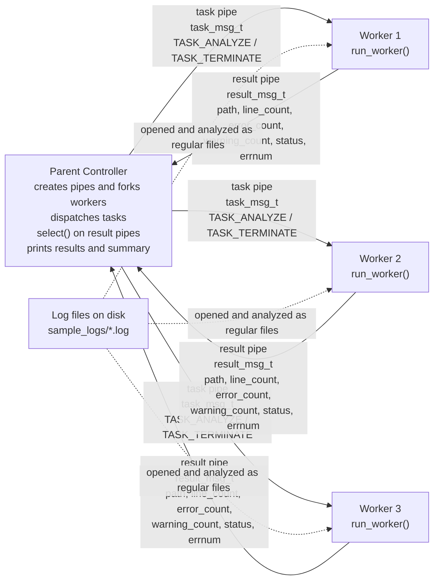

# Architecture Diagram Draft

## Items That Must Appear in the Final Figure

- One parent controller process.
- Three worker processes labeled clearly as separate children.
- One parent-to-worker task pipe for each worker.
- One worker-to-parent result pipe for each worker.
- Arrow directions on every pipe.
- Labels on task pipes showing `task_msg_t` with `TASK_ANALYZE` and `TASK_TERMINATE`.
- Labels on result pipes showing `result_msg_t` with `path`, counts, `status`, and `errnum`.
- A note that the parent uses `select()` on the result-pipe read ends.
- External log files shown, if desired, as regular file inputs to workers rather than as IPC channels.
- No worker-to-worker pipes.

## Mermaid Diagram

